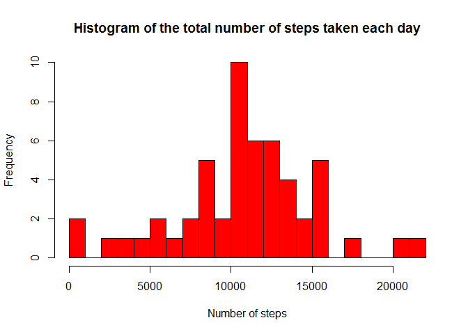
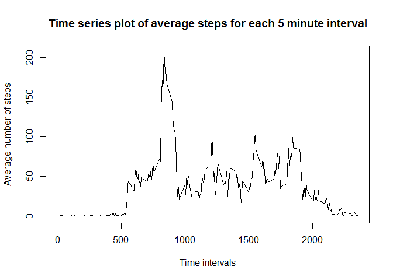
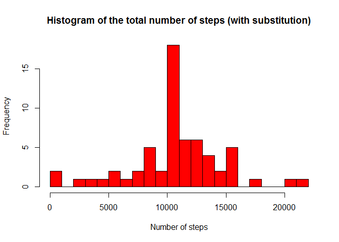

# Reproducible Research: Peer Assessment 1


## Loading and preprocessing the data

Load the data:

```r
activity <- read.csv("activity.csv")
```


## What is mean total number of steps taken per day?


```r
## calculate total number of steps each day for use in the histogram and the calculations of mean and median after
totalSteps <- with (activity, tapply(steps, date, sum))

## Histogram of the total number of steps taken each day
hist(totalSteps, breaks=20, col="red", main="Histogram of the total number of steps taken each day", xlab="Number of steps")
```

 


```r
meanTotalSteps <- round(mean(totalSteps[!is.na(totalSteps)]), 2)
medianTotalSteps <- median(totalSteps[!is.na(totalSteps)])
```

Mean total number of steps taken per day:       1.076619\times 10^{4}  
Median total number of steps taken per day:     10765


## What is the average daily activity pattern?

```r
meanIntervalSteps<-with (activity, tapply(steps[!is.na(steps)], interval[!is.na(steps)], mean))
intervals<-unique(activity$interval)
plot(intervals,meanIntervalSteps, type="l", main="Time series plot of average steps for each 5 minute interval", xlab="Time intervals", ylab="Average number of steps")
```

 


```r
maxInterval <- intervals[match(max(meanIntervalSteps),meanIntervalSteps)]
```

On average across all the days in the dataset, the maximum number of steps is in interval:      835


## Imputing missing values

```r
totalMissing <- length(activity$steps[is.na(activity$steps)])
```

The total number of missing values in the dataset is:   2304


The strategy chosen for filling the missing values in the dataset is to replace NAs with the mean for the corresponding 5-minute interval


```r
fill <- function(x1, x2){
        for (i in 1:length(x1)){
                j=i %% 288
                if(is.na(x1[i])){
                        if(j==0){j=288}
                        x1[i]=x2[j]
                }
        }
        x1
}

filledSteps <- activity$steps
filledSteps <- fill(filledSteps, meanIntervalSteps)

filledActivity <-data.frame(filledSteps, activity$date, activity$interval)
```


```r
## calculate total number of steps each day with filled dataset
totalSteps2 <- with (filledActivity, tapply(filledSteps, activity.date, sum))

## Histogram of the total number of steps taken each day
hist(totalSteps2, breaks=20, col="red", main="Histogram of the total number of steps (with substitution)", xlab="Number of steps")
```

 


```r
meanFilledTotalSteps <- round(mean(totalSteps2, 2))
medianFilledTotalSteps <- median(totalSteps2)

meanDiff <- meanFilledTotalSteps - meanTotalSteps
medianDiff <- round(medianFilledTotalSteps - medianTotalSteps, 2)
```

Mean total number of steps taken per day (with substitution):       1.0766\times 10^{4}  
Median total number of steps taken per day (with substitution:     1.0766189\times 10^{4}  


Difference in means for the two datasets:       -0.19  
Difference in medians for the two datasets:     1.19  

So the impact of imputing missing data on the estimates of the total daily number of steps is very small when using the mean for the corresponding 5-minute interval as a substitute


## Are there differences in activity patterns between weekdays and weekends?
